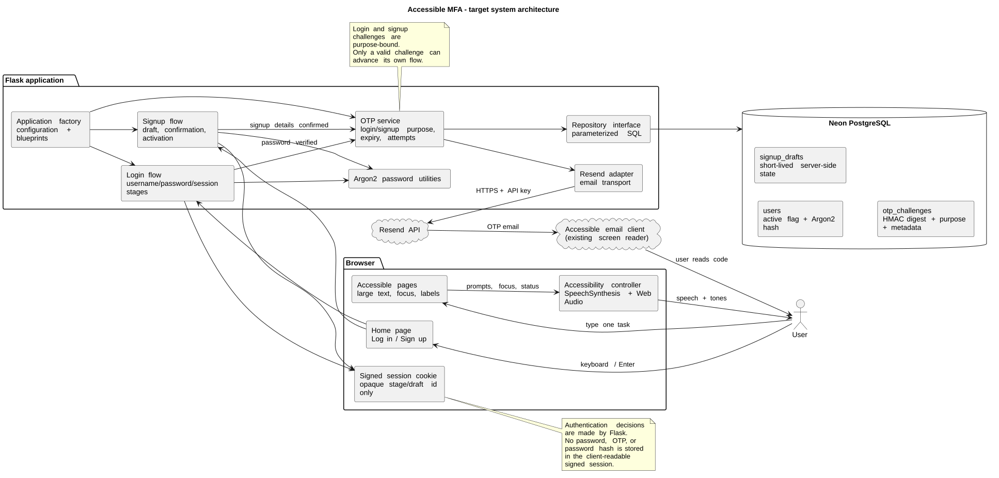

<style>
@page { size: A4; margin: 15mm 16mm 14mm 16mm; }
body { font-family: Arial, Helvetica, sans-serif; font-size: 10.2pt; line-height: 1.28; color: #17202a; }
h1 { font-size: 21pt; line-height: 1.12; margin: 0 0 0.45em; }
h2 { font-size: 14pt; line-height: 1.15; margin: 0.65em 0 0.28em; color: #173b5f; }
h3 { font-size: 11.5pt; line-height: 1.15; margin: 0.45em 0 0.18em; color: #245a8d; }
p { margin: 0.28em 0 0.45em; }
ul, ol { margin-top: 0.2em; margin-bottom: 0.45em; }
li { margin: 0.12em 0; }
table { border-collapse: collapse; width: 100%; font-size: 8.6pt; margin: 0.35em 0 0.6em; }
th, td { border-bottom: 0.5pt solid #aeb8c2; padding: 3px 5px; vertical-align: top; }
th { background: #eef4f8; color: #173b5f; }
pre, code { font-family: Consolas, "Courier New", monospace; }
pre { font-size: 8pt; line-height: 1.15; white-space: pre-wrap; }
img { display: block; max-width: 100%; max-height: 215mm; margin: 0.25em auto 0.1em; }
.figure { page-break-inside: avoid; margin: 0.2em 0 0.55em; }
.caption { text-align: center; font-size: 8.3pt; color: #4d5b66; margin: 0.1em 0; }
.cover { min-height: 245mm; display: flex; flex-direction: column; justify-content: center; }
.cover h1 { font-size: 27pt; color: #173b5f; }
.cover .subtitle { font-size: 15pt; line-height: 1.25; margin: 0.5em 0 1.1em; }
.cover .meta { border-left: 3px solid #245a8d; padding-left: 0.8em; }
.callout { border-left: 3px solid #8b6f2b; background: #f7f1e3; padding: 0.45em 0.65em; margin: 0.45em 0; }
.page-break { page-break-before: always; break-before: page; height: 0; }
.small { font-size: 8.5pt; }
.tight li { margin: 0; }
</style>

<div class="cover">

# Accessible MFA: Overall System Design

<p class="subtitle">Design and Implement a Multifactor Authentication System for Visually Impaired Users</p>

<div class="meta">

**Group:** Cypher  
**System:** Flask web application with accessible login and signup  
**Primary factors:** Password plus email OTP  
**Document status:** Authoritative target-state design  
**Date:** 22 September 2026

</div>

### Group members

| Member | Student ID |
| --- | --- |
| Bandara LHMMD | 230078B |
| Ranasinghe KGDS | 230522H |
| Rathnamalala RIBSP | 230541N |
| Herath HMSBB | 230244G |
| Jitharsanan T | 230305V |

## Executive summary

This design specifies a small, server-controlled Flask authentication system for users who rely on keyboard navigation, large text, browser speech, audio cues, and an existing accessible email client. The system has a simple home page with **Log in** and **Sign up** actions. Login verifies a username and Argon2 password, then requires a new six-digit email OTP before showing the welcome page. Signup collects username, email, password, and confirmation over separate one-task pages, verifies the email with a purpose-bound OTP, activates the account, and returns the user to login without authenticating them automatically.

The design treats accessibility as part of the security boundary. Each action is available through Tab and Enter, every page provides a spoken instruction, focus changes are announced, status and error messages are exposed through semantic live regions, and a generic tone confirms each newly entered OTP digit without revealing its value. Passwords and OTPs are never spoken, persisted in plaintext, or decided by browser JavaScript.

Email OTP is required by the assignment but is not a phishing-resistant, high-assurance authenticator. The final section identifies WebAuthn passkeys as future work; device biometrics remain local to the authenticator and are never collected by this application.

</div>

<div class="page-break"></div>

## 1. Scope, users, and journeys

### 1.1 In scope

- A small Flask application using plain HTML, minimal JavaScript, Neon PostgreSQL, Argon2, Resend, and pytest.
- Keyboard-only operation with semantic labels, one principal task per page, automatic focus, Enter submission, large text, and high-contrast focus indication.
- Browser SpeechSynthesis for instructions, focus announcements, success messages, and safe error messages.
- Web Audio API tones for OTP entry confirmation and OTP errors.
- Login, signup, logout, server-side flow control, inactive accounts, and purpose-bound email OTP challenges.

### 1.2 Out of scope

Password reset, account management, SMS OTP, authenticator applications, custom screen-reader software, native mobile applications, administrator tools, and biometric data collection are outside the current implementation. Passkeys are discussed only as future work.

### 1.3 User journeys

**Login:**

```text
Home -> Username -> Password -> New login OTP -> Welcome -> Logout
```

**Signup:**

```text
Home -> Username -> Email -> Choose password -> Confirm password
     -> Signup OTP -> Activate account -> Login page
```

Signup does not authenticate the user. A later login always requires a new password verification and a new login OTP.

### 1.4 Group responsibility boundaries

| Area | Responsibility |
| --- | --- |
| Foundation | Flask factory, configuration, environment validation, provisioning, integration |
| Accessibility UI | Large-text templates, labels, focus, SpeechSynthesis, Web Audio cues |
| Password flow | Username/password verification, generic errors, ordered login stages |
| Database | Neon connection, schema, migrations, repository, signup drafts |
| Email OTP | Challenge generation, purpose binding, delivery, expiry, attempts, cooldown, replay prevention |

The modules remain independently mergeable. Shared contracts are documented before implementation so a small integration change does not transfer ownership of another module.

<div class="callout"><strong>Design principle:</strong> browser code provides accessible presentation and feedback only. Flask and the database make every authentication, activation, expiry, and stage decision.</div>

<div class="page-break"></div>

## 2. System architecture

The browser is a thin accessibility client. The server owns the flow state and security decisions. The existing screen reader in the user’s email client reads the OTP message; this application does not implement a screen reader.

<div class="figure">



<p class="caption">Figure 1. Target system architecture. Editable source: <a href="diagrams/system-architecture.puml">system-architecture.puml</a>.</p>
</div>

### 2.1 Component responsibilities

| Component | Design responsibility |
| --- | --- |
| Home and templates | Large text, semantic controls, labels, live regions, one task per page |
| Accessibility controller | Focus announcements, page prompts, safe TTS, generic tones, audio fallback |
| Login flow | Lookup, Argon2 verification, dummy-hash timing, login session stages |
| Signup flow | Draft lifecycle, validation, inactive account creation/update, activation redirect |
| OTP service | Secure code generation, HMAC digest, purpose, expiry, attempts, cooldown, replay |
| Repository | Parameterized SQL, atomic state changes, user and challenge records |
| Resend adapter | Plain-text email delivery; provider failures become safe flow errors |
| Neon PostgreSQL | Users, short-lived signup drafts, and OTP challenge metadata |

### 2.2 Configuration boundary

Runtime secrets are loaded from environment variables and are not committed: `SECRET_KEY`, `DATABASE_URL`, `RESEND_API_KEY`, and `RESEND_FROM_EMAIL`. `APP_NAME`, `OTP_EXPIRY_SECONDS`, `OTP_MAX_ATTEMPTS`, and `OTP_RESEND_COOLDOWN_SECONDS` remain configurable. The design defaults are 300 seconds, 5 failed attempts, and 60 seconds respectively.

Production deployment assumes HTTPS. The deployment must enable secure, HTTP-only, SameSite session cookies and must not expose secret values in logs or error pages.

<div class="page-break"></div>

## 3. Authentication flows and interaction guidance

The following flow is the target behavior for both the visible interaction and the server-side transition. Error branches return to the same task and never advance the authenticated state.

<div class="figure">



<p class="caption">Figure 2. Login and signup journeys. Editable source: <a href="diagrams/authentication-flows.mmd">authentication-flows.mmd</a>.</p>
</div>

### 3.1 Home page

`GET /` renders two native links or buttons labelled **Log in** and **Sign up**. The page prompt says: “Press Tab to choose Log in or Sign up, then press Enter.” When focus enters an action, SpeechSynthesis announces “Log in selected” or “Sign up selected.” The visible label remains the source of truth if speech is unavailable.

### 3.2 Login behavior

The username page says “Type your username now.” The password page says “Type your password now.” After a successful password check, the server creates a login-purpose OTP, stores only its HMAC digest and metadata, sends the plain-text code through Resend, and renders the OTP page. The page says “Type the six digit code sent to your email.”

An incorrect, expired, exhausted, or missing code shows an ARIA alert, plays a short error tone, and speaks “The code is incorrect or expired. Try again.” A valid code is consumed once, changes the session to `authenticated`, and redirects to `/welcome`. The welcome prompt says “Login successful.” Logout clears the session and returns to the home page.

### 3.3 Signup behavior

Signup uses separate username, email, password, and password-confirmation pages. A short-lived server-side draft stores normalized values and the Argon2 hash after the password page. The browser session contains only an opaque draft identifier and stage.

After matching confirmation, the server creates or updates an inactive account and issues a signup-purpose OTP. A valid signup OTP atomically consumes the challenge and marks the account active. The server clears signup state and redirects to `/login` with the visible and spoken message “Account created. Log in to continue.” It never sets the authenticated login stage.

An inactive account with the same normalized username and email can resume signup safely. The resume path receives a fresh OTP subject to the same cooldown and attempt controls. Active users and conflicting details receive the generic message “These account details are unavailable.”

<div class="page-break"></div>

## 4. State model and route contract

The server rejects direct navigation to a later page unless the required stage and user/draft binding exist. A route guard always redirects an invalid or stale flow to the home or relevant start page.

<div class="figure">



<p class="caption">Figure 3. Authentication state machine. Editable source: <a href="diagrams/authentication-states.mmd">authentication-states.mmd</a>.</p>
</div>

### 4.1 Route and stage contract

| Route | Method | Required state | Successful result |
| --- | --- | --- | --- |
| `/` | GET | none | Home actions |
| `/login` | GET/POST | none or login start | Username stage |
| `/login/password` | GET/POST | `login_username_submitted` | Password verified, issue login OTP |
| `/login/otp` | GET/POST | `login_password_verified` | Consume login OTP, authenticate |
| `/login/otp/resend` | POST | `login_password_verified` | New login challenge if cooldown allows |
| `/signup` | GET/POST | none or signup start | Username stage |
| `/signup/email` | GET/POST | `signup_username_submitted` | Email stage |
| `/signup/password` | GET/POST | `signup_email_submitted` | Draft password hash |
| `/signup/password/confirm` | GET/POST | `signup_password_created` | Issue signup OTP after match |
| `/signup/otp` | GET/POST | `signup_password_confirmed` | Activate account and return to login |
| `/signup/otp/resend` | POST | `signup_password_confirmed` | New signup challenge if allowed |
| `/welcome` | GET | `authenticated` | Welcome page |
| `/logout` | POST | any | Clear all session state |
| `/health` | GET | none | JSON health response |

### 4.2 Session rules

Login stages are `login_username_submitted`, `login_password_verified`, and `authenticated`. Signup stages are separate and reference only an opaque draft identifier. The session never contains a plaintext password, OTP, OTP digest, or password hash. `mark_authenticated` is reachable only from a valid login OTP verification. Signup activation never calls it.

<div class="page-break"></div>

## 5. Data model and OTP lifecycle

### 5.1 Database entities

| Entity | Required fields | Security rule |
| --- | --- | --- |
| `users` | `id`, `username`, `email`, `password_hash`, `is_active`, timestamps | Password is Argon2 only; inactive users cannot log in |
| `signup_drafts` | opaque id, normalized username/email, `password_hash`, stage, created/updated/expiry | Short-lived server-side state; no plaintext password |
| `otp_challenges` | `id`, `user_id`, `purpose`, `otp_hash`, `expires_at`, `used`, `failed_attempts`, `created_at`, `sent_at` | Purpose-bound HMAC digest; one active challenge per user and purpose |

Existing provisioned demonstration users must be migrated to `is_active = TRUE`. New signup users begin inactive. Draft cleanup removes expired drafts without affecting active users.

### 5.2 Challenge lifecycle

1. Generate a fixed-width six-digit code with `secrets.randbelow(1_000_000)`.
2. Compute HMAC-SHA-256 using the configured server secret; discard the code after composing the email body.
3. Invalidate the previous unused challenge for the same user and purpose.
4. Store the digest, purpose, creation time, sent time, expiry, and zero failed attempts.
5. Send the plain-text code through Resend.
6. If delivery fails, mark the stored challenge unusable and return a safe retry message.
7. On verification, check user binding, purpose, expiry, attempt count, format, and constant-time digest equality.
8. On success, atomically mark the challenge used. For signup, the same transaction activates the user.
9. On a wrong format or code, increment attempts and keep the flow at its current stage.

### 5.3 Repository contracts

The repository exposes parameterized operations for user lookup, draft creation/update/expiry, challenge creation and lookup by `(user_id, purpose)`, attempt increments, challenge invalidation, login challenge consumption, and atomic signup activation. Provider and database exceptions become safe domain errors; raw credentials, SQL, and API responses are never shown to users.

<div class="callout"><strong>Purpose separation:</strong> a signup OTP can only activate an inactive account, while a login OTP can only complete a password-verified login. The two paths cannot cross through a changed form value or URL.</div>

<div class="page-break"></div>

## 6. Security and privacy design

### 6.1 Threat-to-control matrix

| Threat | Control in this design |
| --- | --- |
| Password database disclosure | Argon2 password hashes; no plaintext password storage |
| OTP database disclosure | Keyed HMAC digest, five-minute expiry, attempt limit, one-time use |
| OTP brute force | Six-digit format validation, five failed attempts, purpose binding, cooldown |
| OTP replay | Atomic `used` transition and active-challenge lookup |
| Username enumeration | Same generic login message and dummy-hash verification for unknown users |
| Direct URL bypass | Server-side route guards and ordered session stages |
| Signup/login confusion | Challenge `purpose` checked in every lookup and transition |
| Resend flooding | 60-second server-clock cooldown and old-challenge invalidation |
| Provider failure leakage | Safe user message; provider status, API key, and code stay in logs only as sanitized types |
| SQL injection | Parameterized repository queries |
| Client-side manipulation | Browser never decides authentication; server verifies every transition |
| Audio privacy leak | Same generic OTP tone; never speak or encode the digit value |
| Session exposure | Only opaque stage/user/draft identifiers; secure production cookie settings |

### 6.2 Accessibility as a security property

The user must be able to complete every security decision without a mouse or visual-only control. Labels and status regions prevent the audio layer from becoming a single point of failure. The system never asks a user to read a CAPTCHA, scan a QR code, drag an object, or use a custom screen reader.

Email OTP remains a risk acceptance for this assignment. Email may be protected only by another password, intercepted, or rerouted. The application therefore describes itself as a university demonstration rather than a high-assurance identity service. Production migration should favor phishing-resistant WebAuthn credentials.

### 6.3 Secret and logging rules

Secrets come from environment variables and are absent from Git. Logs may record event categories and exception types for operations, but must not contain usernames, email addresses, passwords, OTPs, hashes, provider payloads, or session-cookie contents. Production HTTPS and a secure session configuration are deployment requirements, not application-managed TLS.

<div class="page-break"></div>

## 7. Large-text, keyboard, TTS, and sound design

### 7.1 Visual interaction

The shared stylesheet uses approximately 20 px base text, 32 px primary headings, large labels and inputs, at least 44 px interactive targets, generous line height, a narrow readable column, high contrast, and a visible focus outline. Native controls preserve browser keyboard semantics. Each page has one principal task and one main input group, with autofocus on load.

### 7.2 Spoken guidance

Every page supplies a concise `data-speech-prompt`. On page load, the controller speaks the prompt or the highest-priority status/error message. On `focusin`, it announces the accessible name of the selected action or control. The home page therefore speaks “Log in selected” and “Sign up selected” as the user presses Tab. Pressing Enter activates the selected native control.

Success and status text is exposed through `role="status"` and `aria-live="polite"`; validation failures use `role="alert"` and `aria-live="assertive"`. Speech can be unavailable or blocked by browser policy, so the same information remains visible and available to an existing screen reader.

### 7.3 OTP audio feedback

- A newly accepted numeric OTP character plays one short, identical Web Audio confirmation tone.
- Backspace does not play an entry tone; a paste plays one identical tone per newly accepted digit.
- The tone never varies by digit and never speaks the code.
- An invalid, expired, or exhausted OTP shows a visible alert, plays a short error tone, and speaks “The code is incorrect or expired. Try again.”
- The login success page speaks “Login successful.”
- Signup completion speaks “Account created. Log in to continue.”

The audio controller cancels stale speech before announcing the newest status, avoids reading field values, and does not make authentication dependent on JavaScript. Audio starts only after a browser-permitted user gesture and has no external media dependency.

### 7.4 Accessible email boundary

The OTP email is plain text with the application name, six-digit code, expiry statement, and a warning for unrequested attempts. The code is read by the user’s existing accessible email client. The web application only says to check email; it never speaks the code.

<div class="page-break"></div>

## 8. Verification, deployment, limitations, and future work

### 8.1 Verification plan

The repository baseline currently contains 70 passing pytest cases across application integration, authentication flow, OTP, repository, configuration, provisioning, password hashing, and accessibility. The target implementation must add conformance tests for:

| Area | Required evidence |
| --- | --- |
| Home | Two native actions, Tab focus, Enter activation, focus speech labels |
| Signup | Ordered stages, validation, separate confirmation page, safe inactive resume |
| Activation | Valid signup OTP activates only the intended user and never authenticates the session |
| Login | Inactive/unknown/wrong-password responses are indistinguishable; new login OTP required |
| OTP isolation | Login and signup purposes cannot be substituted |
| Audio | Generic digit tones, error tone, success/status speech, no field-value speech |
| Route guards | Direct navigation and stale draft/session states are rejected |
| Secrets | No plaintext password/OTP/hash in session, HTML, logs, or database |
| Failure handling | Provider/database errors leave no usable challenge and expose safe messages |

The Markdown deliverable will be rendered temporarily to A4 PDF for page-count and visual checks only. The final output remains Markdown and SVG/source diagrams for later conversion after review.

### 8.2 Deployment assumptions and limitations

The application assumes a trusted deployment environment, HTTPS, protected environment variables, a verified Resend sender, and a Neon PostgreSQL database with the current schema migration applied. Global password throttling, CSRF protection, account recovery, operational monitoring, and email-delivery assurance require additional production work.

### 8.3 Passkey future work

WebAuthn/FIDO2 passkeys are the preferred future direction. A passkey stores a public-key credential for this relying party; the private key remains in the device or security key. The platform may require fingerprint, face recognition, device PIN, pattern, or a hardware-key gesture. Biometric data stays inside the authenticator and is not sent to the application. The server would store credential ID, public key, sign counter, and user association, then verify signed assertions with user verification requested.

Passkey rollout must retain an accessible fallback and account-recovery process for users without a compatible authenticator. It must not assume that every user has a fingerprint sensor or that biometrics are the only local verification method.

### 8.4 References

1. NIST, *SP 800-63B Digital Identity Guidelines: Authentication and Lifecycle Management*, [Authenticators](https://pages.nist.gov/800-63-4/sp800-63b/authenticators/).
2. OWASP, *Authentication Cheat Sheet*, [authentication and automated-attack controls](https://cheatsheetseries.owasp.org/cheatsheets/Authentication_Cheat_Sheet.html).
3. OWASP, *Multifactor Authentication Cheat Sheet*, [MFA risks and phishing-resistant migration](https://cheatsheetseries.owasp.org/cheatsheets/Multifactor_Authentication_Cheat_Sheet.html).
4. W3C, *Web Content Accessibility Guidelines (WCAG) 2.2*, [keyboard and focus requirements](https://www.w3.org/TR/WCAG22/).
5. W3C WAI, *Forms Tutorial*, [labels and instructions](https://www.w3.org/WAI/tutorials/forms/labels/).
6. Flask Documentation, [sessions and secret keys](https://flask.palletsprojects.com/en/stable/quickstart/#sessions).
7. Python Documentation, [`secrets` and `hmac`](https://docs.python.org/3/library/secrets.html) and [constant-time comparison](https://docs.python.org/3/library/hmac.html#hmac.compare_digest).
8. W3C, *Web Authentication: An API for accessing Public Key Credentials - Level 3*, [local user verification and biometric privacy](https://www.w3.org/TR/webauthn/).
9. Resend, [Send Email API reference](https://resend.com/docs/api-reference/emails/send-email).

<p class="small">This document is a target-state design specification. Existing repository behavior is the implementation baseline; the signup, audio, large-text, and focus-announcement requirements above are the acceptance criteria for the next implementation increment.</p>
