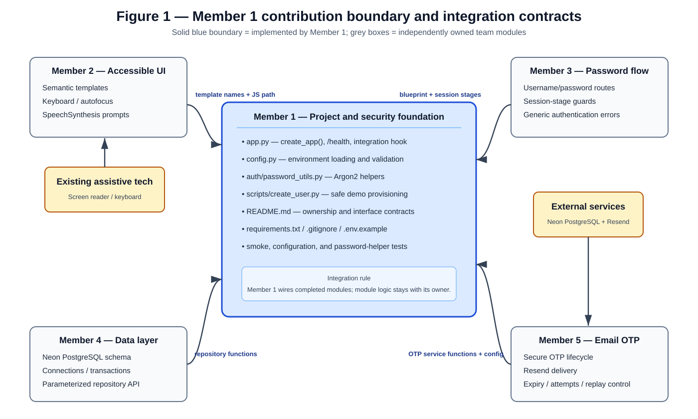
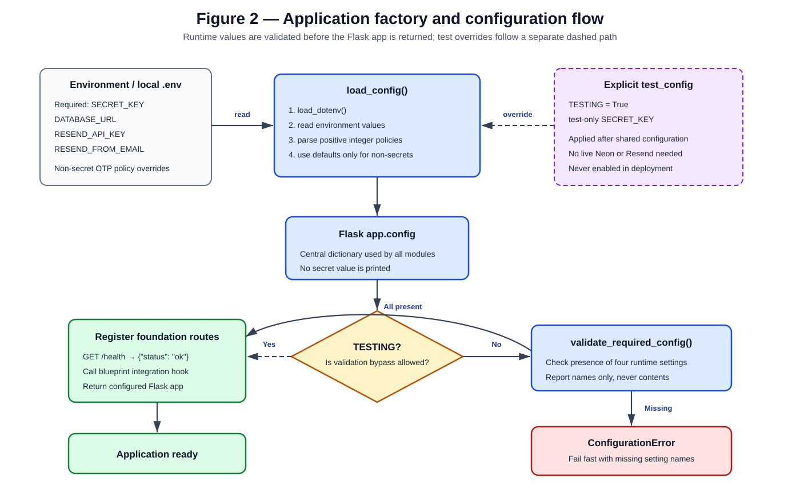
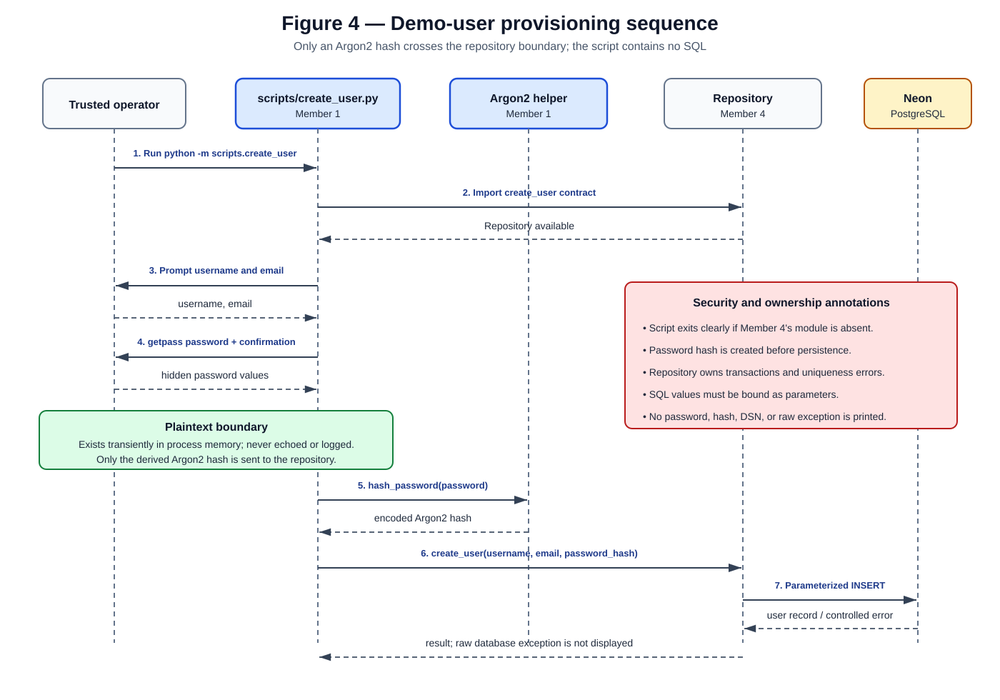

# Individual Design Contribution — Member 1

**Group name:** `Cypher`  
**Student ID:** `230078B`  
**Student name with initials:** `Bandara LHMMD`  
**Project title:** Design and Implement a Multifactor Authentication System for Visually Impaired Users

## 1. Introduction

This document describes my individual contribution as Member 1 of the group. My role was to create the project foundation that the other four members can use when implementing their parts of the system.

My main work was:

- creating the basic Flask project structure;
- creating the Flask application factory;
- loading and validating configuration from environment variables;
- documenting the interfaces shared between members;
- creating a secure demo-user provisioning script;
- adding an Argon2 password-hashing helper; and
- writing basic tests for the foundation.

I did not implement the HTML login pages, login routes, database schema, repository queries, or email OTP service. Those parts are owned by the other group members.

## 2. Assumptions

The following assumptions were used when completing my part:

1. This is a small university project and not a production identity service.
2. The final application will be served using HTTPS. TLS setup is outside the project scope.
3. Registration is not required, so demo users will be created by a trusted group member using a command-line script.
4. Member 4 will provide the PostgreSQL repository and the function `create_user(username, email, password_hash)`.
5. Member 5 will provide the OTP generation, storage, verification, and Resend email code.
6. The initial OTP settings of 5-minute expiry, 5 attempts, and a 60-second resend cooldown are configurable project defaults rather than universal security values.
7. Email OTP is required by the assignment, but it is not considered a strong or phishing-resistant authentication method. NIST specifically does not allow email as an out-of-band authenticator [3]. Therefore, this project should be described as a university demonstration and not as a NIST-compliant high-assurance system.

## 3. My contribution

### 3.1 Project structure

I created and organized the main project files:

```text
app.py
config.py
requirements.txt
.env.example
.gitignore
README.md

auth/
    __init__.py
    password_utils.py

database/
    __init__.py

scripts/
    __init__.py
    create_user.py

templates/
static/

tests/
    __init__.py
    test_app.py
    test_config.py
    test_password_utils.py
```

The folders owned by other members were left mostly empty. This avoids merge conflicts and prevents me from taking ownership of their work.



**Figure 1: Member 1 contribution and connection to other group modules.** The blue area shows the foundation work completed by me. The grey areas show modules owned by Members 2–5. _Source: author's own diagram._

### 3.2 Flask application factory

I implemented `create_app()` in `app.py`. It creates the Flask application, loads its configuration, validates required values, registers a small health route, and provides one place for future blueprints to be registered.

The application factory was chosen because Flask recommends it when applications need different configurations for testing and when modules or blueprints need to be added separately [1]. It allows the tests to create an application using a test configuration without changing the real environment configuration.

The temporary development route is:

```text
GET /health
```

It returns:

```json
{ "status": "ok" }
```

This route only confirms that Flask started. It does not expose configuration values or claim that the complete login flow is implemented.



**Figure 2: Application startup and configuration flow.** Runtime configuration is checked before the application is returned. Tests can provide an explicit test-only configuration. _Source: author's own diagram._

### 3.3 Central configuration

I created `config.py` so that all members use the same configuration names. The following values are loaded from environment variables:

| Setting                       | Purpose                              | Default          |
| ----------------------------- | ------------------------------------ | ---------------- |
| `SECRET_KEY`                  | Signs Flask session data             | No default       |
| `DATABASE_URL`                | Neon PostgreSQL connection URL       | No default       |
| `RESEND_API_KEY`              | Resend API credential                | No default       |
| `RESEND_FROM_EMAIL`           | Email sender address                 | No default       |
| `APP_NAME`                    | Application name shown to users      | `Accessible MFA` |
| `OTP_EXPIRY_SECONDS`          | OTP lifetime                         | `300`            |
| `OTP_MAX_ATTEMPTS`            | OTP attempt limit                    | `5`              |
| `OTP_RESEND_COOLDOWN_SECONDS` | Delay before another OTP can be sent | `60`             |

Secret values have no hard-coded defaults. `.env.example` contains empty placeholders, while `.env` is excluded using `.gitignore`. `SECRET_KEY` is used to sign session data, so it must be long, random, secret, and not committed to source code.

The OTP settings are checked to ensure that they are positive integers. If required runtime configuration is missing, the application reports the missing setting names without printing their values.

### 3.4 Shared contracts

I documented the names that the other modules are expected to use. This reduces the chance that separately developed branches will use incompatible functions.

The main database functions expected from Member 4 are:

```text
get_user_by_username(username)
get_user_by_id(user_id)
create_user(username, email, password_hash)
create_otp_challenge(user_id, otp_hash, expires_at)
get_active_otp_challenge(user_id)
increment_otp_attempts(challenge_id)
mark_otp_used(challenge_id)
invalidate_active_otp_challenges(user_id)
```

Member 4 must use parameterized queries. Values should be passed separately to the database driver instead of being combined directly with SQL strings.

The password function expected by Member 3 is:

```text
verify_password(password_hash, supplied_password) -> bool
```

The expected session stages are:

```text
username_submitted
password_verified
authenticated
```

These stages must be changed only after server-side checks. JavaScript must not make authentication decisions. The actual route guards and session transitions are Member 3 and Member 5's responsibility.

The expected OTP functions from Member 5 are:

```text
issue_otp(user_id)
verify_otp(user_id, submitted_code) -> bool
resend_otp(user_id)
```

Member 5 must generate OTPs using Python's security-focused `secrets` module instead of the normal `random` module.

### 3.5 Password hashing and demo-user creation

Because registration is outside the project scope, I created `scripts/create_user.py` for adding demo users.

The script:

1. checks that Member 4's repository is available;
2. asks for a username and email;
3. uses `getpass` to read the password without displaying it;
4. asks for password confirmation;
5. hashes the password using Argon2; and
6. sends only the username, email, and password hash to the repository.

The script does not contain SQL and does not print the password, hash, database URL, or raw database error. OWASP recommends storing passwords using a modern adaptive hashing algorithm such as Argon2id instead of storing plaintext passwords or using fast general-purpose hashes [2].



**Figure 3: Demo-user provisioning sequence.** The plaintext password is handled only inside the command process. Only the Argon2 hash is sent to Member 4's repository. _Source: author's own diagram._

The current command is:

```text
python -m scripts.create_user
```

Until Member 4 adds `database.repository`, it stops with a clear message instead of attempting its own database implementation.

### 3.6 Dependencies and Git safety

I added the main project dependencies to `requirements.txt`:

- Flask;
- Psycopg 3;
- `argon2-cffi`;
- Resend;
- `python-dotenv`; and
- pytest.

I also created `.gitignore` rules for `.env`, virtual environments, Python bytecode, test caches, editor files, and other generated files. This helps prevent local configuration and temporary files from being committed.

## 4. Accessibility support in my design

Member 2 owns the actual accessible templates and JavaScript. My contribution was to document the required template names and keep the project structure ready for them:

```text
templates/username.html
templates/password.html
templates/otp.html
templates/welcome.html
static/accessibility.js
```

The contract states that each page should have one main task, semantic labels, keyboard submission, automatic focus, and appropriate status messages. Password and OTP values must never be spoken. These requirements follow the accessibility goals stated in the group project brief.

## 5. Main design decisions

| Decision                                      | Reason                                                                                                                |
| --------------------------------------------- | --------------------------------------------------------------------------------------------------------------------- |
| Use a Flask application factory               | Makes testing and later blueprint integration simple [1].                                                             |
| Load secrets from environment variables       | Prevents real credentials from being placed in committed source files.                                                |
| Provide defaults only for non-secret settings | Avoids accidentally running with a known session key or fake production credentials.                                  |
| Use Argon2 for passwords                      | OWASP recommends Argon2id for password storage [2].                                                                   |
| Keep SQL inside Member 4's repository         | Prevents duplicate database code and provides one place to enforce parameterized queries.                             |
| Keep authentication decisions on the server   | Browser-side JavaScript can be changed or bypassed, so security decisions must be repeated on the server.             |
| Keep the foundation small                     | The project is a university assignment and does not require an ORM, frontend framework, or complex dependency system. |
| Document the weakness of email OTP            | NIST does not recognize email as an acceptable out-of-band authenticator [3].                                         |

## 6. Tests completed

I wrote tests for my own files only. The tests check that:

- `create_app()` starts with test configuration;
- `/health` returns HTTP 200 and the expected JSON;
- Flask test mode is enabled;
- normal configuration defaults load correctly;
- environment variables override defaults;
- invalid numeric settings are rejected;
- missing required settings are reported safely;
- `.env.example` does not contain committed secret values;
- Argon2 hashes do not contain the plaintext password; and
- correct, incorrect, and malformed password hashes are handled safely.

The test result was:

```text
10 passed
```

These tests prove that the foundation works. They do not test the complete login process because the frontend, database, password-flow, and OTP modules belong to other members.

## 7. Work still required from other members

- Member 2 must create the accessible HTML pages and SpeechSynthesis helper.
- Member 3 must implement the username/password routes and session-stage protection.
- Member 4 must create the Neon schema, database connection, and repository functions.
- Member 5 must implement secure OTP generation, hashed OTP storage, Resend delivery, expiry, attempts, cooldown, and one-time use.
- After these modules are merged, I will register their Flask blueprints in `app.py` and run integration tests.

## 8. Conclusion

My contribution provides the structure and security foundation needed by the rest of the group. The project can create a test Flask application, load configuration, validate required settings, hash passwords using Argon2, and test the health endpoint. The shared contracts clearly state how the other members' modules should connect to the foundation. The work remains intentionally small and suitable for the assignment.

## References

[1] Pallets Projects, **“Application Factories — Flask Documentation.”** https://flask.palletsprojects.com/en/stable/patterns/appfactories/ (accessed 15 September 2026).

[2] OWASP Foundation, **“Password Storage Cheat Sheet.”** https://cheatsheetseries.owasp.org/cheatsheets/Password_Storage_Cheat_Sheet.html (accessed 15 September 2026).

[3] National Institute of Standards and Technology, **“NIST SP 800-63B — Authentication and Authenticator Management.”** https://pages.nist.gov/800-63-4/sp800-63b.html (accessed 15 September 2026).
