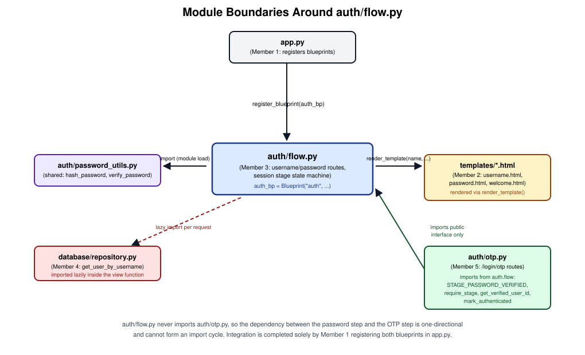
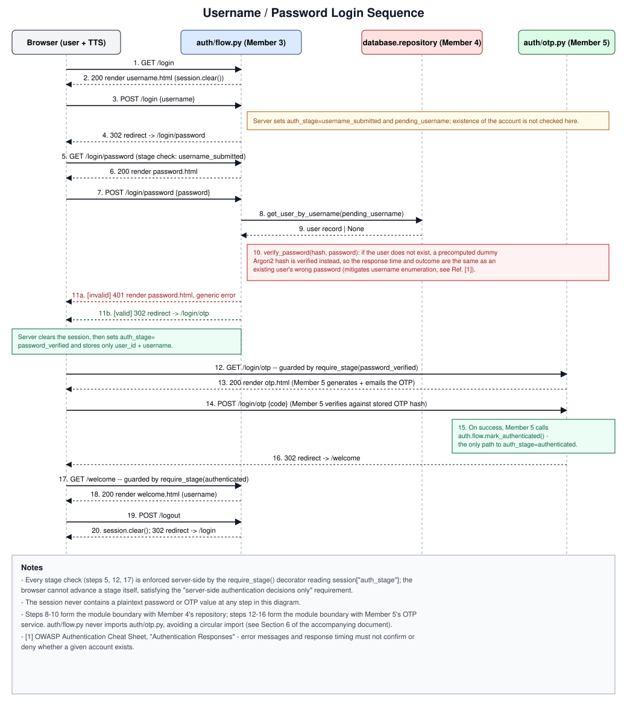
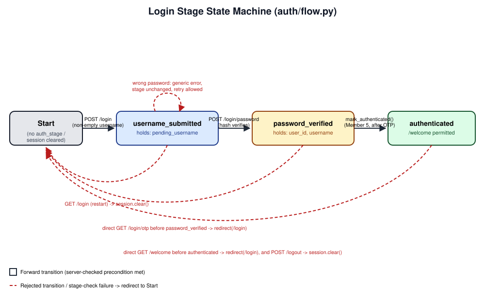

Group Name: cypher
Student ID: 230305V
Student Name: Jitharsanan T.

# Individual Design Contribution — Member 3: Username/Password Authentication and Ordered Login State Machine

## 1. Introduction and Scope of Contribution

This document describes my individual design and implementation contribution to the group's
Multi-Factor Authentication (MFA) system for visually impaired users, developed on the branch
`feature/password-flow`.

My assigned ownership, as agreed in the group's branch/module split (see the project `README.md`,
"Branch and module ownership"), is:

- The username and password authentication routes (`GET/POST /login`, `GET/POST /login/password`).
- The server-side ordered login state machine that prevents any stage of the multi-factor flow from
  being reached out of order.
- The protected welcome route (`GET /welcome`) and logout, which depend on that state machine.
- A clean, importable interface that the OTP module (Member 5) uses to gate its own route and to
  signal full authentication, without either module importing the other's implementation.

Explicitly **out of scope** for this document, and owned by other members: the HTML/ARIA templates
and browser `SpeechSynthesis` behaviour (Member 2), the PostgreSQL schema and repository
implementation (Member 4), and OTP generation/verification/Resend email delivery (Member 5). Where my
design depends on their modules, I describe the interface contract only, not their internal design.

The implementation discussed here lives in `auth/flow.py`, reuses the shared Argon2 helpers in
`auth/password_utils.py` (provided by Member 1 on the foundation branch), and is verified by
`tests/test_auth_flow.py`.

## 2. Assumptions

The following assumptions were necessary to design and implement my module in parallel with
unmerged branches, and are stated explicitly as required by the assignment brief.

1. **Repository contract.** `database.repository.get_user_by_username(username)` returns either a
   single record (a mapping or an object) exposing `id`, `username`, and `password_hash` fields, or
   `None` if no such user exists. This is the contract documented in the shared README and agreed
   with Member 4 before their module was merged.
2. **Password hashing is already solved.** Argon2 hashing and verification (`hash_password`,
   `verify_password`) are a shared utility owned by the foundation branch; my module calls this
   utility but does not re-implement password hashing.
3. **Session storage.** The Flask session is the client-side, cryptographically signed cookie session
   that ships with Flask (`itsdangerous`-signed, not encrypted). This is judged adequate for a
   university prototype because the session never stores a secret value (Section 5.4), and a real
   deployment is assumed to run over HTTPS (stated as an out-of-scope, assumed condition in the
   project README).
4. **Single active login attempt per session.** The design assumes one user completes the wizard in
   one browser session at a time; concurrent tabs during login are not specifically handled, since the
   assignment scope is a single accessible login journey rather than multi-tab session management.
5. **No password brute-force rate limiting in this module.** The assignment's security requirements
   explicitly mandate attempt limits and cooldowns for the *OTP* step (owned by Member 5) but do not
   extend the same requirement to the password step. I have therefore not implemented IP- or
   account-based password throttling; this is recorded as a limitation in Section 8, not silently
   omitted.
6. **CSRF tokens are not implemented.** The assignment's technology stack calls for "minimal
   JavaScript" and a plain-HTML accessible flow; a full CSRF token exchange was judged to add
   complexity disproportionate to a university MFA prototype focused on accessibility and MFA
   correctness. This is recorded as a limitation in Section 8, not presented as a solved problem.
7. **The OTP module is trusted to call `mark_authenticated()` only after its own successful
   verification.** My module cannot verify OTP correctness itself (that is Member 5's ownership); the
   integration contract in Section 6 is the boundary of what my design can enforce.

None of these assumptions weaken a security control that the assignment brief requires of *this*
module; they narrow scope to the module boundaries agreed by the group.

## 3. Design Overview

The overall system implements a four-step accessible login journey: username, password, email OTP,
welcome. My contribution implements the first two steps and the server-side ordering rule that
governs all four. Figure 3 shows how my module (`auth/flow.py`) sits between the templates, the
repository, and the OTP module without creating a two-way dependency.



**Figure 3.** `auth/flow.py` is registered as a Flask blueprint by `app.py` (Member 1). It calls the
shared password-hashing utility directly, calls the repository through a lazily-resolved import (so
the module can be developed and tested before Member 4's branch merges), and renders three templates
by name only (Member 2 owns their content). It exposes a small set of public functions and a
decorator that the OTP module imports — the only points of contact between the two modules.

## 4. Detailed Design

### 4.1 Routes

| Route | Method | Precondition (stage) | Effect on success | Effect on failure |
|---|---|---|---|---|
| `/login` | GET | none | clears session, renders `username.html` | — |
| `/login` | POST | none | sets stage `username_submitted`, stores `pending_username`, redirects to `/login/password` | re-renders `username.html` with a validation message if the field is empty (HTTP 400) |
| `/login/password` | GET | `username_submitted` | renders `password.html` | redirects to `/login` |
| `/login/password` | POST | `username_submitted` | clears session, sets stage `password_verified`, stores `user_id` and `username`, redirects to `/login/otp` | re-renders `password.html` with a generic error (HTTP 401), stage unchanged |
| `/welcome` | GET | `authenticated` | renders `welcome.html` | redirects to `/login` |
| `/logout` | POST | none | clears session, redirects to `/login` | — |

The username step deliberately performs **no existence check** against the repository — a username
is accepted into the wizard unconditionally as long as it is non-empty, so the very first request
already reveals nothing about the account (Section 5.2).

### 4.2 Sequence Design

Figure 1 traces one full login attempt across all four modules, including the point at which control
passes into the OTP module and the single function call that is allowed to complete authentication.



**Figure 1.** Steps 1–11 are entirely within my module's ownership. Steps 8–10 show the repository
boundary: the lookup always returns before the password is checked, and a fixed, precomputed dummy
Argon2 hash stands in for a missing user so the `verify_password` call always executes, keeping the
response indistinguishable by shape or timing (Section 5.2, Ref. [1]). Steps 12–16 show the OTP
module boundary: my module's redirect at step 11b hands control to `/login/otp` by URL only (no
Python import), and the only way back into an authenticated stage is the `mark_authenticated()` call
at step 15, which my module defines and guards (Section 4.3).

### 4.3 State Machine Design

The core artifact of my contribution is the server-side state machine that the assignment brief
requires ("do not trust URL navigation"). Figure 2 is the annotated state diagram.



**Figure 2.** Four states are held in `session["auth_stage"]`: absent/`Start`, `username_submitted`,
`password_verified`, and `authenticated`. Every forward transition is guarded by a check performed in
Python on the server before any template is rendered or any redirect issued; the client cannot set or
influence `auth_stage` directly, since Flask's signed session cookie is opaque to the browser and
tamper-evident (a modified cookie fails signature verification and Flask discards it). Every dashed
red arrow represents a rejected transition — a direct URL visit or a stale session — and all of them
resolve to the same place, `Start`, via `redirect(url_for("auth.login_username"))`, so an attacker
who tries to skip a step never sees partial page content from a later step.

This is implemented as a single reusable decorator, `require_stage(stage)`, rather than a repeated
`if` check inside each view function:

```python
def require_stage(stage: str) -> Callable:
    def decorator(view: Callable) -> Callable:
        @wraps(view)
        def wrapped(*args, **kwargs):
            if current_stage() != stage:
                return redirect(url_for("auth.login_username"))
            return view(*args, **kwargs)
        return wrapped
    return decorator
```

`/login/password` and `/welcome` are both decorated with `require_stage(...)` in my module. The same
decorator, together with the `STAGE_*` constants, is exported so Member 5 can decorate `/login/otp`
with `require_stage(STAGE_PASSWORD_VERIFIED)` identically, giving the whole wizard one consistent
enforcement mechanism instead of three independently-written checks.

## 5. Design Decisions and Justifications

### 5.1 Decorator-based stage guard instead of per-view conditionals

**Decision:** Centralise the "is this session allowed to be here?" check in one decorator
(`require_stage`) rather than duplicating an `if session.get(...) != ...` block in every view.

**Justification:** This is the standard *Guard Clause* / *Decorator* design pattern for cross-cutting
authorisation checks in web frameworks; Flask's own documentation recommends decorators for exactly
this purpose (e.g. its `login_required` pattern in the official Flask "View Decorators" documentation)
[2]. Centralising the check removes the risk that a future route (mine or another member's) forgets
the check, which is a documented common cause of broken access control (OWASP Top 10 2021, A01:2021 —
Broken Access Control) [3].

### 5.2 Generic, identically-worded authentication errors and a dummy-hash comparison

**Decision:** A wrong password and an unknown username produce the exact same message
("Authentication failed. Check your credentials and try again."), the same HTTP status (401), and the
same rendered template; and the wrong-username case still performs a full Argon2 verification against
a fixed placeholder hash rather than short-circuiting.

**Justification:** Distinguishing "wrong password" from "no such account" through wording, status
code, or response latency is a textbook account/username-enumeration vulnerability. The OWASP
Authentication Cheat Sheet's "Authentication Responses" guidance states that a system must not reveal
in its error messages, or through timing differences, whether a given account exists [1]. Argon2
verification is deliberately not skipped for a missing user because Argon2 is intentionally
slow/memory-hard [4]; skipping it for missing accounts would make that branch measurably faster and
leak the same information through timing that the message text was designed to hide.

### 5.3 Argon2 for password hashing (reused from the shared module)

**Decision:** Passwords are only ever compared through `auth.password_utils.verify_password`, which
wraps Argon2id via `argon2-cffi`.

**Justification:** OWASP's Password Storage Cheat Sheet lists Argon2id as its first-choice
recommended algorithm for new applications [5], and Argon2id is the variant standardised by the IETF
in RFC 9106 specifically for its resistance to both GPU cracking and side-channel/timing attacks [4].
While the hashing utility itself is a shared module (not part of my individual contribution), the
decision to route every credential comparison through it, and never through `==` on a stored value, is
part of my module's design.

### 5.4 Minimal session state; no password or OTP ever stored server- or client-side in session

**Decision:** `session` only ever contains `auth_stage`, and, once available, `pending_username`
(before verification) or `user_id`/`username` (after verification). The submitted password value is
read from the request form, used once for verification, and discarded when the request ends; it is
never assigned into `session`.

**Justification:** NIST SP 800-63B (Digital Identity Guidelines, Authentication and Lifecycle
Management) requires that authenticator secrets — of which a password is one — never be retained
beyond the verification transaction, and that only claims necessary to the transaction be carried
forward in session state [6]. `tests/test_auth_flow.py::test_password_is_never_written_to_the_session`
enforces this as a regression test (Section 7).

### 5.5 Full session reset (`session.clear()`) at every stage transition, not incremental mutation

**Decision:** Rather than adding a new key to the existing session dict at each step, my module calls
`session.clear()` and then repopulates only the keys the next stage needs.

**Justification:** This prevents *stage rollback/mixing* bugs where a stale key from an earlier,
abandoned attempt (e.g. a `pending_username` left over from a previous, failed attempt under a
different username) could be read by a later stage. It also limits the blast radius of session fixation:
if a session cookie is reused after a failed attempt, clearing it on every successful transition means
no accumulated state survives from the discarded attempt.

### 5.6 Lazy import of the repository module

**Decision:** `database.repository` is imported inside `_load_repository()`, called per-request,
rather than with a top-level `from database.repository import get_user_by_username`.

**Justification:** This is a practical consequence of the group's parallel-branch workflow: at the
time my module was implemented, `feature/neon-database` had not yet been merged. A top-level import
would make my entire module fail to import — and therefore fail every test — until another member's
branch landed. The lazy import also directly enables dependency substitution in unit tests (Section 7)
without a mocking framework that patches import machinery.

### 5.7 One-directional dependency: `auth/flow.py` never imports `auth/otp.py`

**Decision:** The redirect from the password step to the OTP step (`/login/otp`) is a literal URL
string, not a call into an imported OTP function; conversely, my module exposes `STAGE_*` constants,
`require_stage`, `current_stage`, `get_verified_user_id`, and `mark_authenticated` specifically so
Member 5's module can import *from* mine.

**Justification:** Two modules that import each other create a circular import, which in Python either
fails outright or silently binds a partially-initialised module depending on import order — a known,
hard-to-diagnose class of bug. Keeping the dependency edge one-directional (Figure 3) is a standard
acyclic-dependency design principle and was a specific requirement of this task ("Avoid circular
imports").

## 6. Integration Contract Exposed to Other Members

The following are the only symbols from `auth/flow.py` that another member's module should import:

| Symbol | Purpose |
|---|---|
| `STAGE_USERNAME_SUBMITTED`, `STAGE_PASSWORD_VERIFIED`, `STAGE_AUTHENTICATED` | Named stage values, so other modules never hard-code the string literals. |
| `require_stage(stage)` | Decorator to gate a view behind a required session stage (used by Member 5 for `/login/otp` with `STAGE_PASSWORD_VERIFIED`). |
| `current_stage()` | Read-only accessor for the session's current stage. |
| `get_verified_user_id()` | Returns the `user_id` established at the password step, for the OTP module to associate a challenge with a user. |
| `mark_authenticated()` | The only supported way to advance a session to `STAGE_AUTHENTICATED`; raises `RuntimeError` if called from any stage other than `STAGE_PASSWORD_VERIFIED`, so it cannot be used to skip the password step by accident. |
| `OTP_LOGIN_PATH` | The literal path (`/login/otp`) my module redirects to, exposed as a constant rather than a magic string. |

## 7. Testing Strategy

`tests/test_auth_flow.py` contains 20 tests covering this module in isolation, using two test doubles
so the suite does not depend on unmerged branches or on the real accessible templates:

- A `FakeRepository` class stands in for `database.repository`, injected via
  `monkeypatch.setattr(flow, "_load_repository", ...)`.
- `render_template` is monkeypatched to a stub that records the template name and context passed to
  it, so tests assert on *what would be shown* without depending on Member 2's HTML.

Coverage includes, directly matching the assignment's required test list: correct credentials reaching
the OTP redirect; a wrong password not advancing the stage; a wrong password and an unknown username
producing byte-identical error output; direct navigation to `/login/password` and to a simulated
OTP-style route (decorated with `require_stage`, standing in for Member 5's real route) being rejected
before their precondition stage is reached; `/welcome` being rejected before `authenticated`; an
explicit assertion that no password value, correct or incorrect, is ever present in the session; and
the normal forward state transitions and `mark_authenticated`'s own guard condition.

## 8. Limitations and Future Work

- **No password-attempt rate limiting.** Unlike the OTP step, this module does not currently limit
  repeated password guesses for a given username or client. A production version should add a
  cooldown or attempt counter, analogous to the OTP module's, referenced against OWASP's guidance on
  credential-stuffing and brute-force protections [1].
- **No expiry on the `password_verified` stage.** If a user completes the password step and abandons
  the browser tab before completing OTP, that session remains at `password_verified` until it is
  cleared by a subsequent `/login` visit or logout, rather than timing out automatically. A future
  version should store a timestamp alongside the stage and expire it after a short window.
- **No CSRF token.** As stated in Section 2, form submissions are not protected by a CSRF token. This
  is acceptable for the scope of this assignment but would need addressing before production use.
- **Future biometric/WebAuthn factor**, mentioned as an explicit possibility in the project brief, would
  plug into this same state machine as an additional stage between `password_verified` and
  `authenticated`, reusing the `require_stage`/`mark_authenticated` pattern already in place.

## 9. References

[1] OWASP Foundation, "Authentication Cheat Sheet," OWASP Cheat Sheet Series.
    https://cheatsheetseries.owasp.org/cheatsheets/Authentication_Cheat_Sheet.html

[2] Pallets Projects, "View Decorators," Flask Documentation.
    https://flask.palletsprojects.com/en/latest/patterns/viewdecorators/

[3] OWASP Foundation, "A01:2021 – Broken Access Control," OWASP Top 10:2021.
    https://owasp.org/Top10/A01_2021-Broken_Access_Control/

[4] A. Biryukov, D. Dinu, D. Khovratovich, and S. Josefsson, "Argon2 Memory-Hard Function for Password
    Hashing and Proof-of-Work Applications," RFC 9106, Internet Engineering Task Force, Sept. 2021.
    https://www.rfc-editor.org/rfc/rfc9106

[5] OWASP Foundation, "Password Storage Cheat Sheet," OWASP Cheat Sheet Series.
    https://cheatsheetseries.owasp.org/cheatsheets/Password_Storage_Cheat_Sheet.html

[6] P. Grassi, J. Fenton, et al., "Digital Identity Guidelines: Authentication and Lifecycle
    Management," NIST Special Publication 800-63B, National Institute of Standards and Technology,
    June 2017 (updated).
    https://pages.nist.gov/800-63-3/sp800-63b.html

[7] Pallets Projects, "Sessions," Flask Documentation (client-side signed session cookies).
    https://flask.palletsprojects.com/en/latest/quickstart/#sessions
