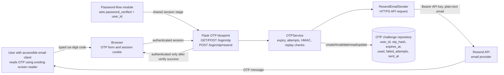
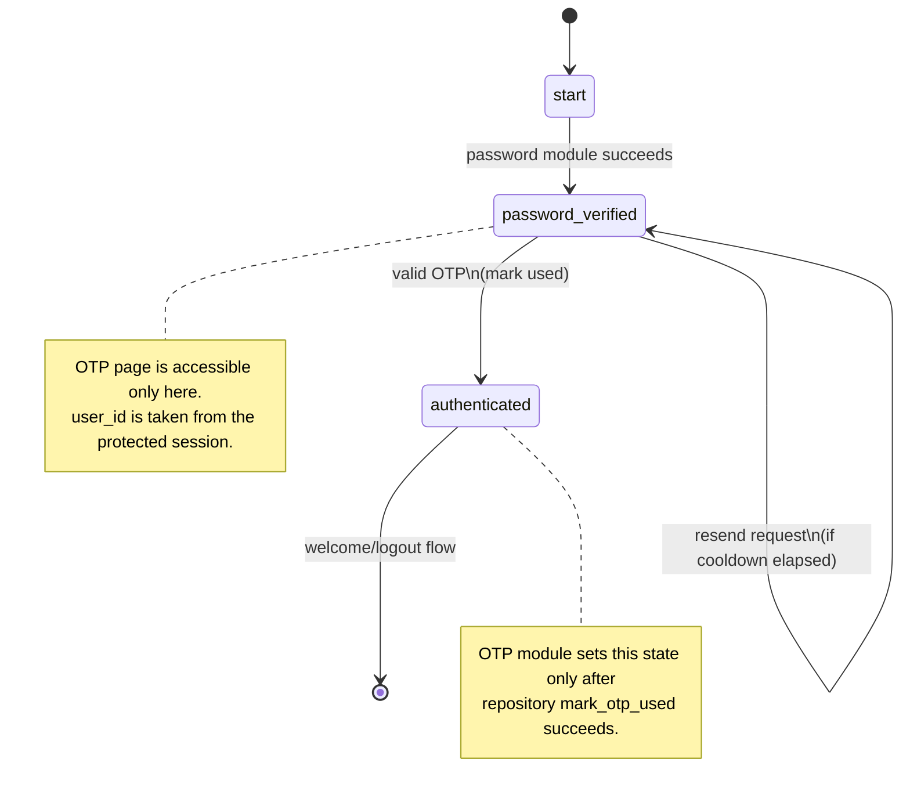
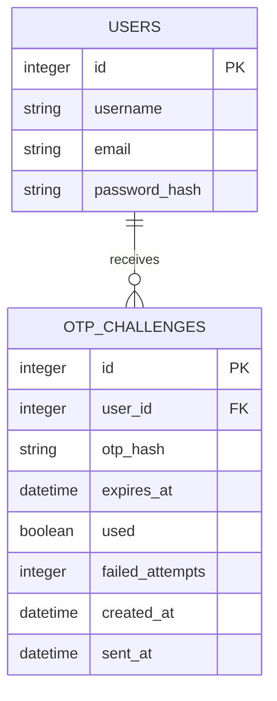

# Group Project: Multifactor Authentication for Visually Impaired Users

**Group name:** [ENTER GROUP NAME]

**Student ID:** [ENTER STUDENT ID]

**Student name with initials:** [ENTER FULL NAME WITH INITIALS]

**Individual submission:** Member 5 - Email OTP, Resend delivery, and MFA security testing

**Repository branch:** `feature/email-otp`

**Submission format:** Markdown source for conversion to PDF

---

## 1. Contribution Summary

My contribution is the second authentication factor: a server-side email one-time password (OTP) service. The contribution is implemented in `auth/otp.py` and tested in `tests/test_otp.py`.

The contribution provides:

1. Cryptographically secure six-digit OTP generation using Python's `secrets` module.
2. Keyed HMAC storage of the OTP rather than plaintext storage.
3. Five-minute expiry, five failed-attempt maximum, one-time use, and a 60-second resend cooldown.
4. Invalidation of the previous active challenge when a new challenge is issued.
5. Plain-text email delivery through the Resend HTTP API.
6. Safe handling of provider failures without exposing provider details to the user.
7. Flask routes for displaying, verifying, and resending an OTP.
8. Session-stage enforcement so the OTP step cannot be entered before password verification.
9. Automated tests for the security properties of the OTP flow.

The implementation deliberately does not implement password authentication, PostgreSQL connection management, registration, the screen-reader interface, or the user-facing HTML design. Those belong to other group members. The module exposes a small repository protocol so it can be integrated with the group's database repository without duplicating database code.

---

## 2. Scope and Boundaries

### 2.1 In scope

- Generation of a numeric OTP on the server.
- Delivery of the OTP to the email address belonging to the authenticated user record.
- Storage of only a keyed digest in the OTP challenge record.
- Verification of the OTP against the current user's active challenge.
- Expiry and replay protection.
- Failed-attempt and resend-abuse controls.
- Resend API integration.
- OTP-specific Flask route behavior.
- Security-focused automated tests.

### 2.2 Out of scope

- Password hashing and password verification.
- User registration and account recovery.
- PostgreSQL driver and connection-pool implementation.
- HTML templates and browser SpeechSynthesis behavior.
- TLS implementation. Production HTTPS is an environmental requirement.
- SMS, authenticator applications, TOTP applications, biometrics, WebAuthn, CAPTCHA, and custom screen-reader software.

### 2.3 Ownership boundary

The OTP module depends on two interfaces:

```text
OTPRepository
  invalidate_active_otp_challenges(user_id)
  create_otp_challenge(user_id, otp_hash, expires_at, sent_at)
  get_active_otp_challenge(user_id)
  increment_otp_attempts(challenge_id)
  mark_otp_used(challenge_id)

OTPEmailSender
  send(recipient, subject, body)
```

The database member supplies `OTPRepository`. The production Resend implementation is supplied by `ResendEmailSender`, while tests use an in-memory sender fake. This boundary keeps database ownership and email-factor ownership separate.

---

## 3. Explicit Assumptions

The following assumptions are made deliberately and are necessary to interpret the design correctly.

| ID | Assumption | Reason and integration consequence |
|---|---|---|
| A1 | Password authentication has already succeeded before the OTP blueprint is reached. | The password-flow member sets `session['auth_stage'] = 'password_verified'` and `session['user_id']`. The OTP blueprint does not reimplement password verification. |
| A2 | The session is server-protected by Flask's configured `SECRET_KEY`, and production uses HTTPS. | The browser must not be able to alter the authentication stage or user identity without invalidating the session signature. HTTPS protects the session cookie in transit. |
| A3 | `session['user_id']` is the internal database user ID, not an email address or username. | The OTP repository queries challenges by the authenticated internal user ID, preventing cross-user challenge lookup. |
| A4 | `get_user_by_id(user_id)` returns a mapping or object containing the registered `email` field. | The resend route obtains the recipient from the database account rather than accepting an email address from the browser. |
| A5 | The database repository treats a challenge as active only when it is unused and belongs to the requested user. | This is required for expiry, replay, invalidation, and cross-user checks to be effective. The repository must implement this with parameterized SQL. |
| A6 | The configured OTP secret is available from an environment-backed application configuration and is not committed to Git. | HMAC verification requires a server-side secret. The current service rejects an empty secret. |
| A7 | The Resend account, sender domain, API key, and recipient email are valid and configured outside source control. | The implementation cannot deliver email without valid provider configuration. Provider failures are converted to a generic application error. |
| A8 | A five-minute lifetime, five attempts, and 60-second resend cooldown are acceptable project defaults. | These values are configurable through `OTPSettings` and are intended to be supplied by the centralized project configuration. |
| A9 | The email account is available to the user through an existing screen reader or accessible email client. | The web application speaks only the instruction to enter the code; it does not implement a screen reader and never speaks the OTP value. |
| A10 | The repository's invalidation and challenge-creation operations are reliable database operations. | If database writes fail after email delivery, the email may contain a code for which no challenge exists. The integration should use transactions and expose a safe retry response. |
| A11 | The current project uses the endpoint names supplied by the shared flow contract: `login_password` for the password page and `welcome` for the post-authentication page. | The route factory uses these endpoint names when redirecting. If the integration chooses different endpoint names, the blueprint factory must be adapted during wiring. |

No assumption grants authentication based on client-side JavaScript, a visual interaction, an email address supplied by the user, or a code stored in the browser/session.

---

## 4. Design Overview

The service has three layers:

1. **OTP service layer (`OTPService`)**: performs generation, HMAC derivation, expiry checks, comparison, attempt counting, and challenge consumption.
2. **Email transport layer (`ResendEmailSender`)**: constructs the Resend request and translates transport/provider failures into `OTPDeliveryError`.
3. **Flask integration layer (`create_otp_blueprint`)**: checks the shared login stage, reads the submitted code, updates the authenticated session only after service verification, and returns generic user-facing errors.

The service receives a clock function as a dependency. This makes time-dependent behavior deterministic in tests without changing production behavior.

### 4.1 Security data flow

```text
OTP plaintext
  -> email body only
  -> HMAC-SHA-256 using server secret
  -> otp_hash stored in challenge repository

Submitted OTP
  -> server receives form value
  -> same HMAC operation
  -> constant-time comparison with stored otp_hash
  -> mark challenge used on success
```

The plaintext code is not stored in PostgreSQL, the Flask session, or application logs. It is temporarily present in the email request body because delivery is the purpose of the factor.

### 4.2 Challenge lifecycle

A challenge is created only after the Resend sender accepts the email request. The repository receives:

- `user_id`
- `otp_hash`
- `expires_at`
- `sent_at`

The service first checks the current active challenge to enforce cooldown. After the email is accepted, it invalidates the previous active challenge and creates the new record. A successful verification calls `mark_otp_used`. Invalid codes call `increment_otp_attempts`.

---

## 5. Detailed Design Decisions and Justification

### D1. Use `secrets.randbelow` for OTP generation

The six-digit value is generated as:

```python
f"{secrets.randbelow(1_000_000):06d}"
```

This gives a fixed-width value from `000000` to `999999` and uses the operating system's cryptographically secure randomness through Python's `secrets` module. The standard `random` module is intended for simulation and is not suitable for security-sensitive tokens.

The fixed width is important because a six-digit OTP is a user-facing protocol value. Leading zeroes must remain valid and must not be removed by integer conversion.

### D2. Store a keyed HMAC rather than plaintext or an unsalted fast hash

The stored value is:

```text
HMAC-SHA-256(OTP_SECRET, submitted_or_generated_OTP)
```

The server compares the newly calculated digest with the stored digest using `hmac.compare_digest`. A keyed HMAC means the database value alone is not sufficient to calculate valid comparisons without the server secret. This reduces the impact of a database-only disclosure compared with storing plaintext OTPs.

An OTP still has only one million possible values, so HMAC storage is not a complete defense against an attacker who also obtains the HMAC secret and can make unlimited offline guesses. The design therefore also requires short expiry, one-time use, attempt limits, protected secrets, and database access control.

### D3. Use constant-time comparison

`hmac.compare_digest` is used instead of ordinary string comparison. This is the standard library's comparison operation for reducing timing differences when comparing secret-derived values. The comparison is performed server-side and the result is not decided by JavaScript.

### D4. Bind every lookup to the authenticated user ID

The service calls repository methods with `user_id`, and the Flask route obtains that ID from the password-verified session. It does not accept a user ID, email address, or username from the OTP form. The repository contract must therefore query by a parameterized user ID and challenge ID.

This prevents a valid code issued to one account from being used to authenticate another account through a changed form value or URL.

### D5. Expire challenges after five minutes

`expires_at` is calculated from the server clock and checked before code comparison. Expiry is enforced server-side, so changing the browser clock or form fields cannot extend the challenge. The lifetime is a setting rather than a hard-coded policy so the group configuration can supply the agreed value.

### D6. Make challenges one-time use

A successful comparison calls `mark_otp_used`. Later repository lookups must exclude used records. Consequently, a copied email code cannot be replayed after the first successful use.

### D7. Limit incorrect attempts

The service rejects a challenge once `failed_attempts` reaches `max_attempts`, with a default of five. Invalid format and incorrect six-digit values both consume an attempt. Expired, missing, or already exhausted challenges return the same generic verification error.

The error intentionally does not reveal whether the challenge was missing, expired, exhausted, or simply incorrect.

### D8. Add resend cooldown and invalidate the old challenge

A resend is blocked when less than 60 seconds have elapsed since `sent_at`. After the cooldown, the previous active challenge is invalidated before the new challenge is stored. This prevents immediate email flooding and ensures the newest code is the only active code.

The cooldown is checked against the server clock, not a browser timer.

### D9. Send plain text through Resend

The email subject is:

```text
Your <Application Name> OTP
```

The body is plain text:

```text
Your <Application Name> OTP is: 123456.
It expires in 5 minutes.
If you did not attempt to sign in, you can ignore this email.
```

Plain text avoids unnecessary visual layout and is straightforward for screen-reader-compatible email clients. The current application is responsible for speaking only the page instruction, not the secret value.

### D10. Fail safely when Resend fails

The transport catches expected network/provider errors and raises `OTPDeliveryError("OTP delivery failed")`. The Flask resend route maps this to a generic user message. The API key, provider response, exception details, and OTP are not returned to the user.

The sender uses an injectable opener, allowing tests to mock the HTTP call without contacting Resend.

### D11. Enforce the stage transition in the Flask route

The GET, POST, and resend routes require both:

```text
session['auth_stage'] == 'password_verified'
session['user_id'] is not None
```

On success only, the POST route sets:

```text
session['auth_stage'] = 'authenticated'
```

A direct request to `/login/otp` before password verification redirects to the password endpoint. A failed code leaves the session at `password_verified` and cannot redirect to the welcome page.

---

## 6. Annotated Architecture Diagram

The editable diagram source is [architecture.mmd](diagrams/architecture.mmd).



**Annotations:**

- The browser never decides whether authentication succeeds; it submits data to the server.
- `OTPService` is the security decision point.
- The database stores the digest and challenge metadata, not the code.
- Resend is an external delivery dependency and is isolated behind `OTPEmailSender`.
- The user accesses the email through an existing accessible email client, not a custom screen reader implemented by this project.

---

## 7. Annotated Verification Sequence Diagram

The editable diagram source is [verification-sequence.mmd](diagrams/verification-sequence.mmd).

```mermaid
sequenceDiagram
    actor User
    participant Browser
    participant Flask as OTP Blueprint
    participant Service as OTPService
    participant Repo as OTP Repository
    participant Resend as Resend API

    Note over Browser,Flask: Session must contain auth_stage=password_verified and user_id
    User->>Browser: Open OTP page
    Browser->>Flask: GET /login/otp
    Flask->>Flask: Check session stage
    Flask-->>Browser: Render one-code OTP page

    Browser->>Flask: POST /login/otp with code
    Flask->>Service: verify(user_id, submitted_code)
    Service->>Repo: Get active challenge for user_id
    Repo-->>Service: otp_hash, expiry, attempts, used state
    Service->>Service: Check attempts and expiry
    Service->>Service: HMAC(code), compare_digest

    alt Code is valid
        Service->>Repo: mark_otp_used(challenge_id)
        Flask->>Flask: Set auth_stage=authenticated
        Flask-->>Browser: Redirect /welcome
    else Code is invalid or expired
        Service->>Repo: increment_otp_attempts(challenge_id)
        Flask-->>Browser: Generic error; remain password_verified
    end

    User->>Browser: Request resend
    Browser->>Flask: POST /login/otp/resend
    Flask->>Service: issue(user_id, registered_email)
    Service->>Repo: Check sent_at cooldown
    Service->>Resend: Send new plain-text OTP
    Resend-->>Service: Success or provider failure
    Service->>Repo: Invalidate old, create new HMAC challenge
```

The diagram shows that the success transition occurs after `mark_otp_used`, while an invalid submission cannot set the authenticated session stage.

---

## 8. Authentication State Diagram

The editable diagram source is [state-machine.mmd](diagrams/state-machine.mmd).



The OTP module owns only the transition from `password_verified` to `authenticated`; it does not create the earlier username/password states.

---

## 9. OTP Challenge Data Model

The editable diagram source is [challenge-data-model.mmd](diagrams/challenge-data-model.mmd).



Required repository behavior:

- `get_active_otp_challenge(user_id)` must exclude used and expired challenges.
- `invalidate_active_otp_challenges(user_id)` must affect only that user.
- `mark_otp_used(challenge_id)` must make the challenge unusable for later verification.
- `increment_otp_attempts(challenge_id)` must update the same challenge atomically where practical.
- All user-controlled values must be passed as SQL parameters.

---

## 10. Error and Abuse-Control Matrix

| Event | Server action | User-facing result | Security effect |
|---|---|---|---|
| No active challenge | Reject verification | Generic invalid/expired message | Does not reveal whether a user or challenge exists |
| Expired challenge | Reject verification | Generic invalid/expired message | Five-minute limit enforced by server clock |
| Wrong six-digit code | Increment attempts and reject | Generic invalid/expired message | Brute-force window is limited |
| Wrong format or non-six-digit input | Increment attempts and reject | Generic invalid/expired message | Malformed input cannot bypass attempt counting |
| Maximum attempts reached | Reject without another comparison | Generic invalid/expired message | Challenge is no longer usable |
| Correct code | Mark used and authenticate | Redirect to welcome | One-time use prevents replay |
| Resend before 60 seconds | Reject issue request | Wait message | Limits email/API abuse |
| Resend after cooldown | Send new code, invalidate old code | Return to OTP page | Only newest challenge remains active |
| Resend provider failure | Raise safe delivery error | Generic retry-later message | Does not expose API details or secret data |
| OTP route before password stage | Redirect to password route | Password step | Prevents URL bypass |

---

## 11. Security Test Evidence

The test module contains 11 tests. They use in-memory repository and sender fakes for normal automation, and a mocked HTTP opener for the Resend request. No real API key or email is required.

| Test area | Evidence in `tests/test_otp.py` |
|---|---|
| Six-digit generation and no plaintext database value | `test_generates_six_digit_code_and_persists_only_digest` |
| Correct code | `test_correct_code_succeeds_and_used_code_cannot_replay` |
| Replay rejection | Same test verifies a second submission fails |
| Incorrect code and attempt count | `test_incorrect_code_fails_and_counts_attempt` |
| Expiry | `test_expired_code_fails` |
| Previous code invalid after resend | `test_resend_invalidates_previous_code` |
| Resend cooldown | `test_resend_cooldown_works` |
| Attempt maximum | `test_attempt_limit_works` |
| Safe provider failure | `test_delivery_failure_is_safe_and_does_not_persist_code` |
| Resend API mocked | `test_resend_api_sender_is_mocked_without_network_access` |
| Route stage protection and authenticated transition | `test_otp_routes_enforce_password_stage_and_authenticate` |
| Wrong route submission does not authenticate | `test_otp_routes_do_not_authenticate_on_wrong_code` |

Executed result in the project virtual environment:

```text
11 passed in 0.15s
```

The tests prove the service behavior with fakes. They do not replace a later integration test against PostgreSQL, because the repository implementation is owned by another member.

---

## 12. Limitations and Integration Risks

1. **Email is not phishing-resistant.** An email OTP is a second factor for this assignment, but a future production system could consider WebAuthn/passkeys for stronger phishing resistance. That is future work and is not implemented here.
2. **The OTP is visible in the user's email account.** Security therefore depends on the user's email account and accessible email client being protected.
3. **The six-digit space is intentionally small.** Expiry, attempt limits, one-time use, HTTPS, session protection, and secret management are required compensating controls.
4. **Provider delivery is not proof of inbox delivery.** Resend accepting an API request does not guarantee that the user received or read the email.
5. **Email-before-database ordering requires transactional integration care.** The current service sends first so a failed provider call never creates a challenge. If the subsequent database write fails, integration code should return a safe error and provide operational retry handling without issuing duplicate active challenges.
6. **The route endpoint names are integration assumptions.** The password-flow member must either use `login_password` and `welcome` or adjust the URL generation in the blueprint factory.
7. **The HMAC secret must be rotated operationally.** Changing it invalidates existing challenge digests; this is acceptable for short-lived OTP challenges but should be documented in deployment procedures.

---

## 13. Verification and Reproducibility

From the repository root:

```bash
python3 -m venv .venv
.venv/bin/pip install Flask pytest
.venv/bin/python -m pytest -q
```

Expected result for the current module tests:

```text
11 passed
```

The production Resend API requires environment-backed values supplied by the group configuration:

```text
RESEND_API_KEY=<provider secret, never committed>
RESEND_FROM_EMAIL=<verified sender address>
SECRET_KEY=<application/session/HMAC secret, never committed>
```

No real provider request is made by the automated tests.

---

## 14. References

Accessed 15 September 2026.

1. Python Software Foundation, **`secrets` - Generate secure random numbers for managing secrets**, especially the guidance that `secrets` is for cryptographically strong random numbers suitable for security-sensitive data.  
   https://docs.python.org/3/library/secrets.html
2. Python Software Foundation, **`hmac` - Keyed-Hashing for Message Authentication**, including `hmac.compare_digest` for avoiding ordinary equality comparison of secret-derived values.  
   https://docs.python.org/3/library/hmac.html
3. Python Software Foundation, **`hashlib` - Secure hashes and message digests**, including SHA-256 support used by the HMAC construction.  
   https://docs.python.org/3/library/hashlib.html
4. Resend, **Send Email API Reference**, including the email request fields and Bearer API authentication used by the sender.  
   https://resend.com/docs/api-reference/emails/send-email
5. Flask Documentation, **Using the session**, describing Flask's signed-cookie session mechanism and the requirement for a secret key.  
   https://flask.palletsprojects.com/en/stable/quickstart/#sessions
6. OWASP Foundation, **Authentication Cheat Sheet**, covering generic authentication error messages, rate limiting, and layered authentication protections.  
   https://cheatsheetseries.owasp.org/cheatsheets/Authentication_Cheat_Sheet.html
7. OWASP Foundation, **Session Management Cheat Sheet**, covering session protection, cookie security, and HTTPS considerations.  
   https://cheatsheetseries.owasp.org/cheatsheets/Session_Management_Cheat_Sheet.html
8. OWASP Foundation, **Forgot Password Cheat Sheet**, including guidance relevant to short-lived, single-use, rate-limited verification tokens.  
   https://cheatsheetseries.owasp.org/cheatsheets/Forgot_Password_Cheat_Sheet.html
9. NIST, **SP 800-63B Digital Identity Guidelines: Authentication and Lifecycle Management**, for context on OTP authenticators, replay resistance, throttling, and the distinction between authentication factors.  
   https://pages.nist.gov/800-63-4/sp800-63b.html
10. W3C Web Accessibility Initiative, **Forms Tutorial**, for the separate group-member accessibility layer's use of labels, instructions, and accessible form structure.  
    https://www.w3.org/WAI/tutorials/forms/

---

## 15. Final Statement of Individual Contribution

I designed and implemented the email OTP second factor and its security controls. The implementation keeps OTP decisions on the server, separates the factor service from the database and email transport interfaces, avoids plaintext OTP persistence, limits guessing and resend abuse, prevents replay, protects authentication-stage transitions, and provides automated evidence for the principal security requirements. The module is intentionally small so it can be merged with the other members' password-flow, database, configuration, and accessibility components without taking ownership of those modules.
